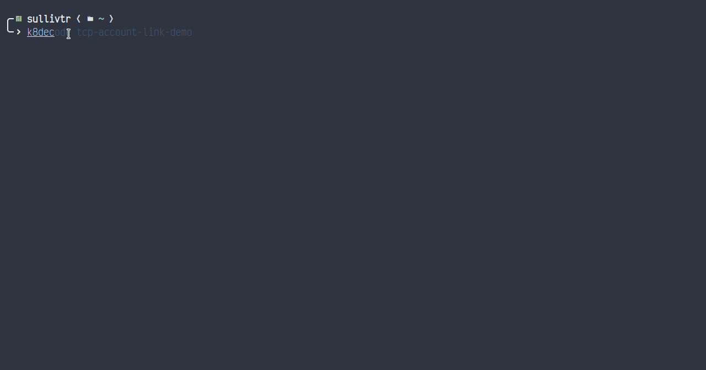

# Auto decode kubernetes secrets 



<!--  -->

```bash
k8decode {secret-name} [-n] {namespace}
```
The namespace flag's default value is `default`. Use `-n` to specify an alternate namespace for the secret. 

For `tab` autocompletion, download the `k8decode_completion.sh` bash completion script included in this repo

```bash
k8decode [tab]

# OR

k8decode secretsubstring[tab]
```

If you use ZSH, you can use the autocomplete script by doing the following

```bash
# RUN
autoload -U +X bashcompinit && bashcompinit
source /path/to/script
```
